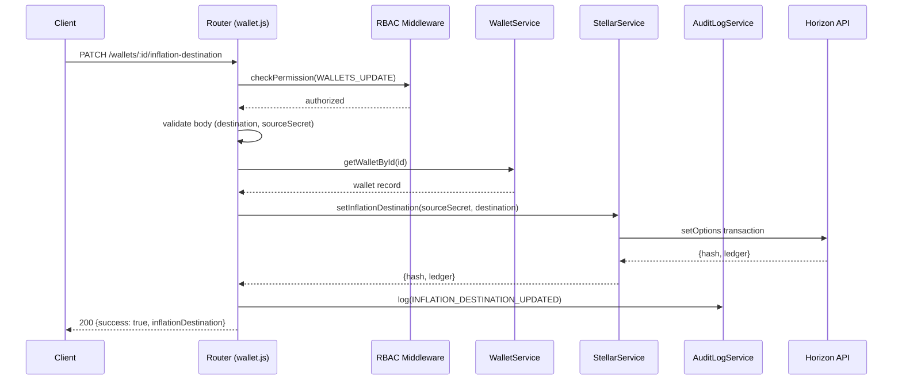
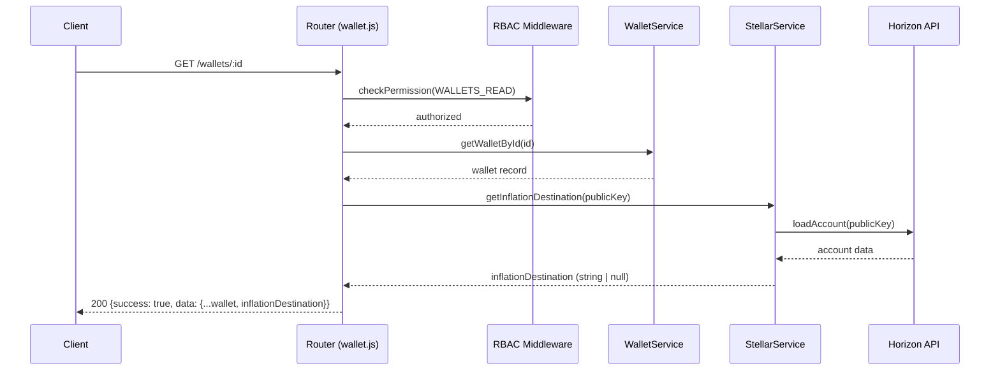

# Design Document: Stellar Inflation Destination

## Overview

This feature adds read and write support for the Stellar `inflation_destination` account field through the wallet management API. Although Stellar's inflation mechanism is deprecated and no longer distributes rewards, the field remains a valid on-chain attribute. The implementation follows the existing patterns in the codebase: a new `PATCH /wallets/:id/inflation-destination` endpoint, an extension to `GET /wallets/:id`, a new `setInflationDestination` method on `StellarService`, input validation via `stellar-sdk`, and audit trail logging via `AuditLogService`.

## Architecture

The feature fits cleanly into the existing layered architecture without introducing new layers or cross-cutting concerns.





## Components and Interfaces

### 1. Route Handler — `src/routes/wallet.js`

Two changes to the existing wallet router:

**New endpoint: `PATCH /wallets/:id/inflation-destination`**

```
PATCH /wallets/:id/inflation-destination
Authorization: x-api-key (WALLETS_UPDATE permission required)
Body: { destination: string, sourceSecret: string }
Response 200: { success: true, data: { inflationDestination: string } }
Response 400: { success: false, error: { message: string } }
Response 404: { success: false, error: { message: string } }
Response 502: { success: false, error: { message: string } }
```

**Modified endpoint: `GET /wallets/:id`**

The existing handler is extended to call `StellarService.getInflationDestination(wallet.address)` and merge the result into the response. If Horizon is unavailable, the field defaults to `null` and the request still succeeds.

### 2. Schema Validation

A new `validateSchema` config for the PATCH body:

```js
const inflationDestinationSchema = validateSchema({
  params: { fields: { id: { type: 'integerString', required: true } } },
  body: {
    fields: {
      destination: { type: 'string', required: true, trim: true },
      sourceSecret: { type: 'string', required: true, trim: true },
    },
  },
});
```

The `destination` value is further validated by `StellarService.setInflationDestination` using `StrKey.isValidEd25519PublicKey`.

### 3. StellarService — `src/services/StellarService.js`

Two new public methods:

**`setInflationDestination(sourceSecret, destinationPublicKey)`**

```
Input:  sourceSecret (string), destinationPublicKey (string)
Output: Promise<{ hash: string, ledger: number }>
Throws: ValidationError — if destinationPublicKey fails StrKey.isValidEd25519PublicKey
Throws: BusinessLogicError — if Horizon rejects the transaction
```

Implementation steps:
1. Validate `destinationPublicKey` with `StellarSdk.StrKey.isValidEd25519PublicKey`. Throw `ValidationError` immediately if invalid.
2. Derive source keypair from `sourceSecret`.
3. Load source account via `_executeWithRetry`.
4. Build a `TransactionBuilder` with a single `setOptions({ inflationDest: destinationPublicKey })` operation.
5. Sign and submit via `_submitTransactionWithNetworkSafety`.
6. Return `{ hash, ledger }`.

**`getInflationDestination(publicKey)`**

```
Input:  publicKey (string)
Output: Promise<string | null>  — the inflation_destination field or null
```

Implementation steps:
1. Load account via `_executeWithRetry`.
2. Return `account.inflation_destination || null`.
3. On any error, return `null` (graceful degradation for GET /wallets/:id).

### 4. StellarServiceInterface — `src/services/interfaces/StellarServiceInterface.js`

Add two abstract method stubs:

```js
async setInflationDestination(_sourceSecret, _destinationPublicKey) {
  throw new Error('setInflationDestination() must be implemented');
}

async getInflationDestination(_publicKey) {
  throw new Error('getInflationDestination() must be implemented');
}
```

### 5. MockStellarService — `src/services/MockStellarService.js`

Add two mock implementations:

**`setInflationDestination(sourceSecret, destinationPublicKey)`**
- Validate `destinationPublicKey` format (same regex as `_validatePublicKey`).
- Find source wallet by secret; throw `ValidationError` if not found.
- Store `inflationDestination` on the wallet object.
- Return `{ hash: 'mock_<hex>', ledger: <random> }`.

**`getInflationDestination(publicKey)`**
- Look up wallet by public key.
- Return `wallet.inflationDestination || null`.
- Return `null` if wallet not found (graceful degradation).

### 6. AuditLogService — `src/services/AuditLogService.js`

Add a new action constant:

```js
INFLATION_DESTINATION_UPDATED: 'INFLATION_DESTINATION_UPDATED',
```

No other changes to `AuditLogService` are required.

## Data Models

### Request Body (PATCH)

```json
{
  "destination": "GABC...XYZ",
  "sourceSecret": "SABC...XYZ"
}
```

The `sourceSecret` field is used only transiently within `StellarService.setInflationDestination` to sign the transaction. It is never stored, logged, or returned.

### Response Body (PATCH 200)

```json
{
  "success": true,
  "data": {
    "inflationDestination": "GABC...XYZ"
  }
}
```

### Response Body (GET /wallets/:id — extended)

```json
{
  "success": true,
  "data": {
    "id": "1234567890",
    "address": "GABC...XYZ",
    "label": "My Wallet",
    "ownerName": "Alice",
    "createdAt": "2024-01-01T00:00:00.000Z",
    "inflationDestination": "GDEST...XYZ"
  }
}
```

`inflationDestination` is `null` when no destination is set or when Horizon is unavailable.

### Audit Log Entry

```json
{
  "category": "WALLET_OPERATION",
  "action": "INFLATION_DESTINATION_UPDATED",
  "severity": "MEDIUM",
  "result": "SUCCESS",
  "userId": "<api-key-id>",
  "requestId": "<request-id>",
  "ipAddress": "<client-ip>",
  "resource": "/wallets/:id/inflation-destination",
  "details": {
    "walletId": "<id>",
    "inflationDestination": "<destination-public-key>"
  }
}
```

Note: `sourceSecret` is explicitly excluded from `details`. The `maskSensitiveData` utility in `AuditLogService._log` provides an additional safety net, but the route handler must never include `sourceSecret` in the `details` object.

## Correctness Properties

*A property is a characteristic or behavior that should hold true across all valid executions of a system — essentially, a formal statement about what the system should do. Properties serve as the bridge between human-readable specifications and machine-verifiable correctness guarantees.*

### Property 1: Valid PATCH sets inflation destination and returns correct response

*For any* existing wallet ID, valid Stellar public key as `destination`, and valid `sourceSecret`, a `PATCH /wallets/:id/inflation-destination` request should return HTTP 200 with `success: true` and an `inflationDestination` field equal to the submitted `destination`.

**Validates: Requirements 1.1, 1.2**

---

### Property 2: Invalid public key strings are rejected with 400

*For any* string that fails `StrKey.isValidEd25519PublicKey` (including empty strings, non-G-prefixed strings, wrong-length strings, and non-string types), submitting it as `destination` in a PATCH request should return HTTP 400 with a descriptive error message identifying the field and expected format.

**Validates: Requirements 1.3, 4.1, 4.2, 4.3**

---

### Property 3: Non-existent wallet ID returns 404

*For any* wallet ID that does not exist in the data store, a `PATCH /wallets/:id/inflation-destination` request should return HTTP 404.

**Validates: Requirements 1.6**

---

### Property 4: GET /wallets/:id always includes inflationDestination field

*For any* existing wallet, a `GET /wallets/:id` response should always include an `inflationDestination` field in the `data` object. The value is either a valid Stellar public key string (when set) or `null` (when unset or when Horizon is unavailable).

**Validates: Requirements 2.1, 2.2, 2.3, 2.4**

---

### Property 5: setInflationDestination with invalid key throws ValidationError before network call

*For any* string that fails `StrKey.isValidEd25519PublicKey`, calling `StellarService.setInflationDestination` should throw a `ValidationError` without submitting any transaction to the Stellar network.

**Validates: Requirements 3.3, 4.1, 4.4**

---

### Property 6: setInflationDestination with valid inputs returns hash and ledger

*For any* valid `sourceSecret` and valid `destinationPublicKey`, a successful call to `StellarService.setInflationDestination` should return an object containing a non-empty `hash` string and a positive integer `ledger` number.

**Validates: Requirements 3.1, 3.2, 3.5**

---

### Property 7: Successful PATCH creates audit log with all required fields

*For any* successful `PATCH /wallets/:id/inflation-destination` request, the audit log should contain exactly one new entry with `category: WALLET_OPERATION`, `action: INFLATION_DESTINATION_UPDATED`, `severity: MEDIUM`, `result: SUCCESS`, and `details` containing `walletId` and `inflationDestination`.

**Validates: Requirements 5.1, 5.2, 5.4**

---

### Property 8: sourceSecret never appears in audit log entries

*For any* `PATCH /wallets/:id/inflation-destination` request (successful or failed), the `sourceSecret` value from the request body should not appear in any field of any audit log entry created by that request.

**Validates: Requirements 6.4**

---

## Error Handling

| Scenario | HTTP Status | Error Source |
|---|---|---|
| Missing `destination` field | 400 | Schema validation middleware |
| Missing `sourceSecret` field | 400 | Schema validation middleware |
| `destination` is not a valid Stellar public key | 400 | `StellarService.setInflationDestination` (ValidationError) |
| Wallet ID not found | 404 | `WalletService.getWalletById` (NotFoundError) |
| Stellar network error during setOptions | 502 | Route handler catches error from StellarService |
| Unauthenticated request | 401 | RBAC middleware (UnauthorizedError) |
| Insufficient permissions | 403 | RBAC middleware (ForbiddenError) |
| Horizon unavailable during GET | — (graceful) | `getInflationDestination` returns null |

The route handler for PATCH wraps the `StellarService` call in a try/catch. Stellar network errors (non-ValidationError, non-NotFoundError) are mapped to HTTP 502 with a descriptive message. The error is also logged via `AuditLogService` with `result: FAILURE`.

```js
try {
  const result = await stellarService.setInflationDestination(sourceSecret, destination);
  await AuditLogService.log({ ..., result: 'SUCCESS', details: { walletId, inflationDestination: destination } });
  return res.json({ success: true, data: { inflationDestination: destination } });
} catch (error) {
  if (error instanceof ValidationError) return next(error); // → 400
  if (error instanceof NotFoundError) return next(error);   // → 404
  // Stellar network error → 502
  await AuditLogService.log({ ..., result: 'FAILURE', details: { error: error.message } });
  return res.status(502).json({ success: false, error: 'Stellar network error: ' + error.message });
}
```

## Testing Strategy

### Dual Testing Approach

Both unit tests and property-based tests are required. Unit tests cover specific examples, integration points, and error conditions. Property-based tests verify universal properties across many generated inputs.

### Property-Based Testing

Use **fast-check** (already compatible with Jest) as the property-based testing library.

Each property test must run a minimum of **100 iterations** and be tagged with a comment referencing the design property:

```js
// Feature: stellar-inflation-destination, Property 2: Invalid public key strings are rejected with 400
```

**Property test implementations:**

| Property | Generator | Assertion |
|---|---|---|
| P1 | `fc.record({ walletId: existingId, destination: validStellarKey, sourceSecret: validSecret })` | Response is 200, body has `inflationDestination === destination` |
| P2 | `fc.string().filter(s => !StrKey.isValidEd25519PublicKey(s))` | Response is 400, error message mentions `destination` |
| P3 | `fc.integer({ min: 999999, max: 9999999 })` (IDs that don't exist) | Response is 404 |
| P4 | `fc.record({ walletId: existingId })` | Response has `data.inflationDestination` field (string or null) |
| P5 | `fc.string().filter(s => !StrKey.isValidEd25519PublicKey(s))` | `setInflationDestination` throws `ValidationError`, no Horizon call made |
| P6 | `fc.record({ sourceSecret: validSecret, destination: validStellarKey })` | Returns `{ hash: string, ledger: number }` |
| P7 | `fc.record({ walletId: existingId, destination: validStellarKey, sourceSecret: validSecret })` | Audit log entry exists with all required fields |
| P8 | `fc.record({ walletId: existingId, destination: validStellarKey, sourceSecret: validSecret })` | No audit log field contains the `sourceSecret` value |

### Unit Tests

The 8 specific test cases from Requirement 7 are implemented as unit/integration tests:

1. Valid PATCH returns 200 with `inflationDestination` in body
2. Invalid `destination` address returns 400
3. Missing `destination` field returns 400
4. Missing `sourceSecret` field returns 400
5. Non-existent wallet `id` returns 404
6. `GET /wallets/:id` includes `inflationDestination` field
7. Successful PATCH creates audit log entry with correct fields
8. Stellar network error during PATCH returns 502

Additional unit tests:
- `StellarService.setInflationDestination` calls `StrKey.isValidEd25519PublicKey`
- `StellarService.getInflationDestination` returns `null` when Horizon throws
- Unauthenticated PATCH returns 401
- PATCH with insufficient permissions returns 403
- `sourceSecret` is absent from all audit log fields after a PATCH

### Coverage Target

All new code introduced by this feature must achieve **≥ 95% line coverage**.
